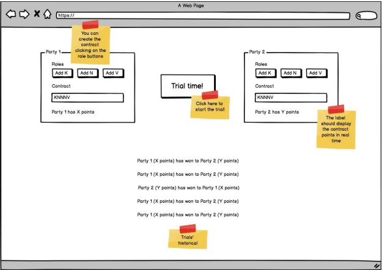

# Frontend-Signaturit

## Test Description

We want you to create a web app connected to the API that you have created on the first phase. It
should allow you to create contracts and display the results of the trials. You will find some ideas on
the following wireframe:



## About

This is the `Full stack` coding challenge of Signaturit.
This project is structured as a `Clean Architecture`, with the principles of `Clean Code` and `SOLID`.

## Commands

Please note that you also need [backend-signaturit](https://github.com/rmyz/backend-signaturit) running in the background in the `PORT=3025` to make the petitions of the game work.

First of all, we need to install the project:

```
  npm i
```

After that, we can both launch the dev server or the test runner.

To launch the dev server:

```
  npm run start
```

To run the tests:

```
  npm run test
```
